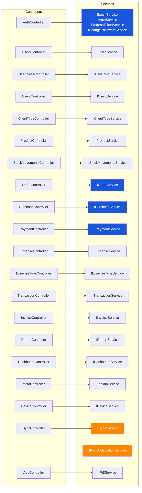
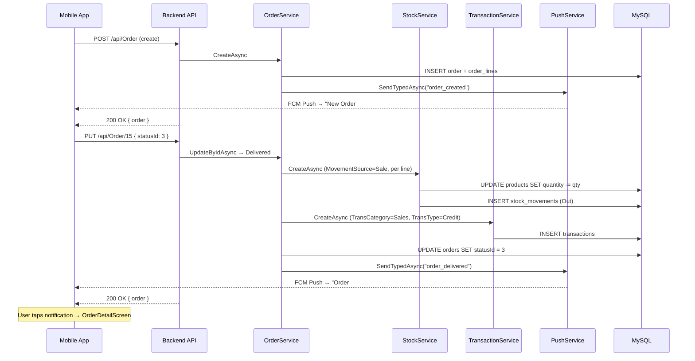
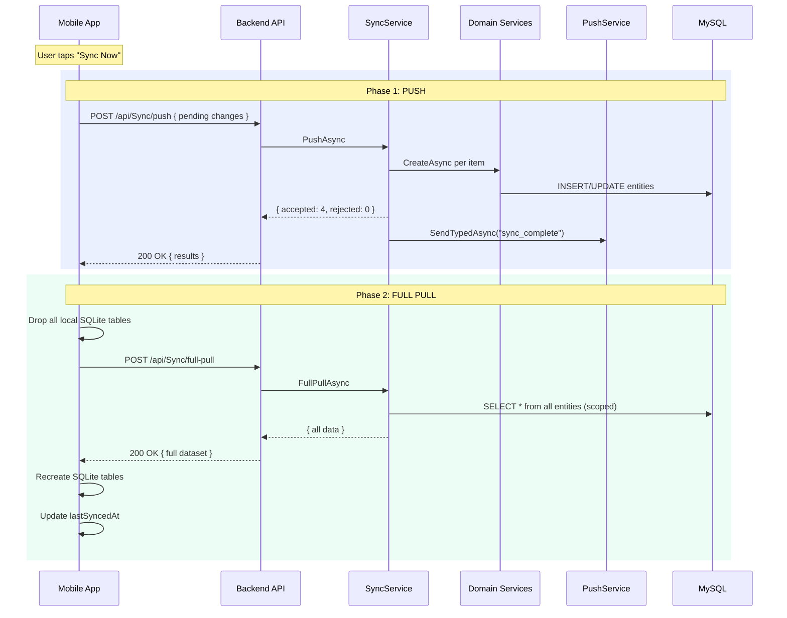
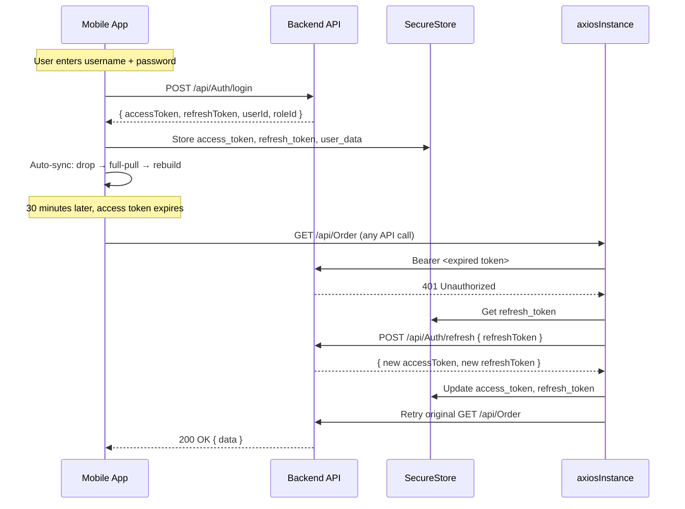
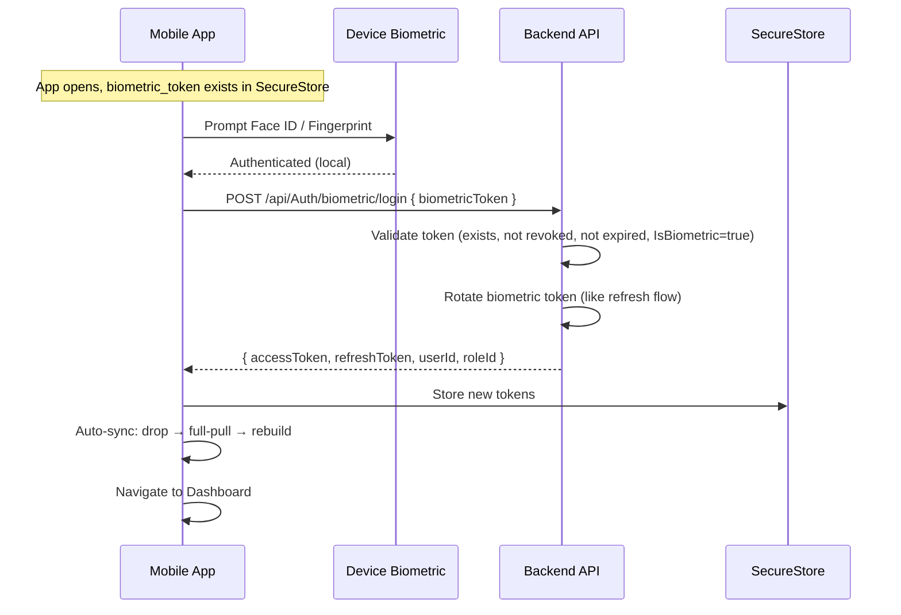
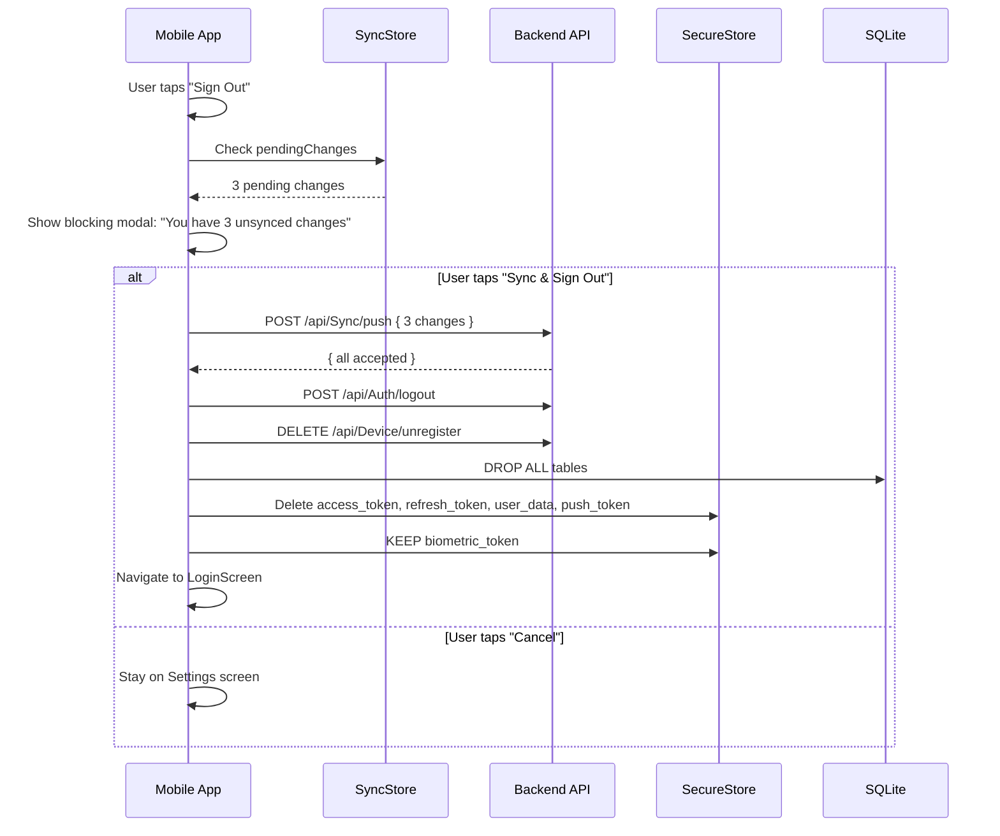
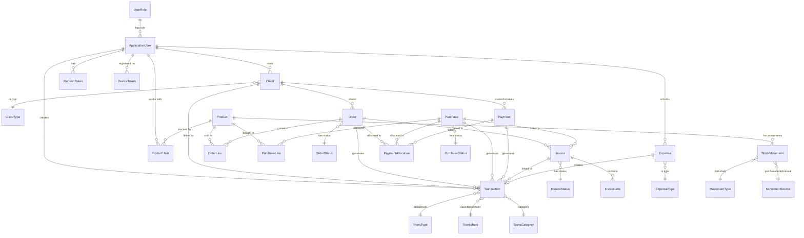

# HamzaTex Architecture Diagrams

---

## 1. Backend Architecture (ASP.NET Core 9 + MySQL)

### 1a. Controller → Service Map



### 1b. Every Service with Methods

```mermaid
graph TB
    subgraph Auth Services
        AUTH_LOGIN[ILoginService<br/>────────────────────<br/>LoginAsync<br/>RefreshTokenAsync<br/>LogoutAsync<br/>LogoutAllAsync]
        AUTH_REG[IUserService<br/>────────────────────<br/>SignupAsync<br/>GetByIdAsync / GetAllAsync<br/>UpdateByIdAsync / DeleteByIdAsync<br/>ResendEmailConfirmationAsync<br/>ForgotPasswordAsync<br/>ResetPasswordAsync<br/>EmailConfirmationTokenAsync]
        AUTH_TOKEN[IRefreshTokenService<br/>────────────────────<br/>CreateRefreshTokenAsync<br/>GetRefreshTokenByTokenAsync<br/>RevokeRefreshTokenAsync<br/>RevokeAllUserTokensAsync<br/>IsRefreshTokenValidAsync<br/>CleanupExpiredTokensAsync<br/>────────────────────<br/>CreateBiometricTokenAsync<br/>BiometricLoginAsync<br/>DisableBiometricAsync]
        AUTH_PWD[IChangePasswordService<br/>────────────────────<br/>ChangePasswordAsync]
    end

    subgraph Domain Services — Core
        CLIENT_SVC[IClientService<br/>────────────────────<br/>CreateAsync<br/>GetByIdAsync / GetAllAsync<br/>GetAllByUserIdAsync<br/>UpdateByIdAsync / DeleteByIdAsync<br/>GetAllPaginatedAsync]
        PROD_SVC[IProductService<br/>────────────────────<br/>CreateWithUserIdAsync<br/>GetByIdAsync / GetAllAsync<br/>UpdateByIdAsync / DeleteByIdAsync<br/>GetAllPaginatedAsync]
        STOCK_SVC[IStockMovementsService<br/>────────────────────<br/>CreateAsync ← weighted avg logic<br/>GetByIdAsync / GetAllAsync<br/>GetAllPaginatedAsync<br/>GetFilteredAsync<br/>UpdateByIdAsync / DeleteByIdAsync]
        ORDER_SVC[IOrderService<br/>────────────────────<br/>CreateAsync<br/>GetByIdAsync / GetAllAsync<br/>GetAllByUserIdAsync<br/>GetAllPaginatedAsync<br/>GetFilteredAsync<br/>UpdateByIdAsync ← status transitions<br/>DeleteByIdAsync]
        PURCH_SVC[IPurchaseService<br/>────────────────────<br/>CreateAsync<br/>GetByIdAsync / GetAllAsync<br/>GetAllByUserIdAsync<br/>GetAllPaginatedAsync<br/>GetFilteredAsync<br/>UpdateByIdAsync ← status transitions<br/>DeleteByIdAsync]
    end

    subgraph Domain Services — Financial
        PAY_SVC[IPaymentService<br/>────────────────────<br/>CreateAsync ← FIFO allocation<br/>GetByIdAsync / GetAllPaginatedAsync<br/>GetAllByUserIdAsync<br/>GetAllByClientIdAsync<br/>GetFilteredAsync<br/>GetUnallocatedCreditAsync<br/>UpdateByIdAsync<br/>ReverseAsync<br/>ReverseAndCorrectAsync<br/>DeleteByIdAsync<br/>ApplyUnallocatedCreditAsync]
        EXP_SVC[IExpenseService<br/>────────────────────<br/>CreateAsync ← atomic ledger<br/>GetByIdAsync / GetAllPaginatedAsync<br/>GetAllByUserIdAsync<br/>GetFilteredAsync<br/>UpdateByIdAsync / DeleteByIdAsync]
        TXN_SVC[ITransactionService<br/>────────────────────<br/>CreateAsync / GetAllAsync<br/>GetByIdAsync / GetAllPaginatedAsync<br/>GetAllByUserIdAsync<br/>GetAllByClientIdAsync<br/>GetFilteredAsync<br/>UpdateByIdAsync / DeleteByIdAsync]
        INV_SVC[IInvoiceService<br/>────────────────────<br/>CreateAsync<br/>CreateFromOrderAsync<br/>CreateFromPurchaseAsync<br/>GetByIdAsync / GetAllPaginatedAsync<br/>GetAllByClientIdAsync<br/>GetFilteredAsync<br/>UpdateByIdAsync ← lifecycle<br/>DeleteByIdAsync<br/>UpdateStatusOnDeliveryAsync<br/>CancelByOrderOrPurchaseAsync<br/>TryMarkPaidAsync<br/>GenerateInvoiceNumberAsync]
    end

    subgraph Lookup & Support Services
        METAL_SVC[ILookupService<br/>────────────────────<br/>GetAllAsync<br/>GetByTypeAsync ← switch dispatch<br/>13 individual Get* methods<br/>────────────────────<br/>GetOrderStatusesAsync<br/>GetPurchaseStatusesAsync<br/>GetPaymentTypesAsync<br/>GetPaymentDirectionsAsync<br/>GetTransTypesAsync<br/>GetTransModesAsync<br/>GetTransCategoriesAsync<br/>GetExpenseTypesAsync<br/>GetMovementTypesAsync<br/>GetMovementSourcesAsync<br/>GetClientTypesAsync<br/>GetUserRolesAsync<br/>GetInvoiceStatusesAsync]
        ROLE_SVC[IUserRoleService<br/>────────────────────<br/>CreateAsync / GetByIdAsync<br/>GetAllAsync / UpdateAsync<br/>DeleteAsync]
        CTYPE_SVC[IClientTypeService<br/>────────────────────<br/>CreateAsync / GetByIdAsync<br/>GetAllAsync / UpdateByIdAsync<br/>DeleteByIdAsync]
        ETYPE_SVC[IExpenseTypeService<br/>────────────────────<br/>CreateAsync / GetByIdAsync<br/>GetAllAsync / UpdateByIdAsync<br/>DeleteByIdAsync ← guarded]
        PDF_SVC[IPdfService<br/>────────────────────<br/>CreatePdf ← html template]
    end

    subgraph Reporting Services
        RPT_SVC[IReportService<br/>────────────────────<br/>GetMonthlyProfitLossAsync<br/>GetClientBalancesAsync<br/>GetClientBalanceByIdAsync<br/>GetMonthlyCreditDebitAsync<br/>GetSummaryTotalsAsync<br/>GetClientDetailsAsync<br/>GetClientDetailByIdAsync]
        DASH_SVC[IDashboardService<br/>────────────────────<br/>GetSummaryAsync ← role-scoped<br/>GetMonthlyOverviewAsync]
    end

    subgraph Sync & Device Services
        SYNC_SVC[ISyncService<br/>────────────────────<br/>PushAsync ← validate batch<br/>FullPullAsync ← all data<br/>PingAsync ← server time]
        DEV_SVC[IDeviceService<br/>────────────────────<br/>RegisterAsync ← upsert token<br/>UnregisterAsync ← soft delete<br/>UnregisterAllAsync]
        PUSH_SVC[IPushNotificationService<br/>────────────────────<br/>SendAsync ← single device<br/>SendToUserAsync ← fan-out<br/>SendTypedAsync ← template]
    end
```

### 1c. Service-to-Service Dependencies

```mermaid
graph TB
    ORDER_SVC[IOrderService]
    PURCH_SVC[IPurchaseService]
    PAY_SVC[IPaymentService]
    EXP_SVC[IExpenseService]
    SYNC_SVC[ISyncService]
    DASH_SVC[IDashboardService]
    INV_SVC[IInvoiceService]

    STOCK_SVC[IStockMovementsService]
    TXN_SVC[ITransactionService]
    PUSH_SVC[IPushNotificationService]
    PDF_SVC[IPdfService]
    CLIENT_SVC[IClientService]
    PROD_SVC[IProductService]

    ORDER_SVC -->|Delivered: stock out + ledger + invoice| STOCK_SVC
    ORDER_SVC -->|Delivered: post credit transaction| TXN_SVC
    ORDER_SVC -->|Cancelled: reversal transaction| TXN_SVC
    ORDER_SVC -->|Delivered: apply unallocated credit| PAY_SVC
    ORDER_SVC -->|Delivered: update invoice status| INV_SVC
    ORDER_SVC -->|Create: push notification| PUSH_SVC
    ORDER_SVC -->|PDF endpoint| PDF_SVC

    PURCH_SVC -->|Delivered: stock in + avg cost| STOCK_SVC
    PURCH_SVC -->|Delivered: post debit transaction| TXN_SVC
    PURCH_SVC -->|Cancelled: reversal transaction| TXN_SVC
    PURCH_SVC -->|Delivered: apply unallocated credit| PAY_SVC
    PURCH_SVC -->|Delivered: update invoice status| INV_SVC
    PURCH_SVC -->|Delivered: push notification| PUSH_SVC
    PURCH_SVC -->|PDF endpoint| PDF_SVC

    PAY_SVC -->|Received/Paid: post transaction| TXN_SVC
    PAY_SVC -->|Create: push notification| PUSH_SVC
    PAY_SVC -->|PDF endpoint| PDF_SVC

    EXP_SVC -->|Create: post debit transaction| TXN_SVC
    EXP_SVC -->|Create: push notification| PUSH_SVC
    EXP_SVC -->|PDF endpoint| PDF_SVC

    INV_SVC -->|Issued: push notification| PUSH_SVC
    INV_SVC -->|PDF endpoint| PDF_SVC

    SYNC_SVC -->|Push: delegates to| CLIENT_SVC
    SYNC_SVC -->|Push: delegates to| ORDER_SVC
    SYNC_SVC -->|Push: delegates to| PAY_SVC
    SYNC_SVC -->|Push: delegates to| EXP_SVC
    SYNC_SVC -->|Push: delegates to| STOCK_SVC
    SYNC_SVC -->|After sync: push notification| PUSH_SVC

    DASH_SVC -->|Monthly overview: reuses| RPT_SVC[IReportService]
    DASH_SVC -->|Summary: queries| DB[(MySQL)]

    STOCK_SVC -->|Low stock: push notification| PUSH_SVC

    style ORDER_SVC fill:#1A56DB,color:#fff
    style PURCH_SVC fill:#1A56DB,color:#fff
    style PAY_SVC fill:#1A56DB,color:#fff
    style SYNC_SVC fill:#FF8800,color:#fff
    style PUSH_SVC fill:#FF8800,color:#fff
    style STOCK_SVC fill:#0E9F6E,color:#fff
    style TXN_SVC fill:#0E9F6E,color:#fff
```



### 1d. Full Backend Layer Diagram

```mermaid
graph TB
    subgraph Clients
        SW[Swagger UI]
        MOBILE[React Native App]
    end

    subgraph Middleware
        MW[Pipeline<br/>─────────────────<br/>JWT Auth Global Filter<br/>CORS AllowAll<br/>FluentValidation Auto<br/>Exception Handler]
    end

    subgraph Controllers — 20 total
        direction TB
        AUTH_C[AuthController<br/>8 endpoints]
        USERS_C[UsersController<br/>6 endpoints]
        ROLES_C[UserRolesController<br/>6 endpoints]
        CLIENT_C[ClientController<br/>8 endpoints]
        CTYPE_C[ClientTypeController<br/>6 endpoints]
        PROD_C[ProductController<br/>7 endpoints]
        STOCK_C[StockMovementsController<br/>8 endpoints]
        ORDER_C[OrderController<br/>9 endpoints]
        PURCH_C[PurchaseController<br/>9 endpoints]
        PAY_C[PaymentController<br/>13 endpoints]
        EXP_C[ExpenseController<br/>9 endpoints]
        ETYPE_C[ExpenseTypeController<br/>6 endpoints]
        TXN_C[TransactionController<br/>9 endpoints]
        INV_C[InvoiceController<br/>11 endpoints]
        RPT_C[ReportController<br/>13 endpoints]
        DASH_C[DashboardController<br/>2 endpoints]
        META_C[MetaController<br/>2 endpoints]
        DEV_C[DeviceController<br/>3 endpoints]
        SYNC_C[SyncController<br/>3 endpoints]
        APP_C[AppController<br/>3 endpoints]
    end

    subgraph Data Layer
        EF[EF Core + Pomelo<br/>Auto-migrate + seed]
        DB[(MySQL 8<br/>33 tables<br/>3 views<br/>─────────<br/>v_monthly_profit_loss<br/>v_client_balance<br/>v_monthly_credit_debit)]
    end

    subgraph External
        SMTP[(SMTP Server<br/>Email + Password Reset)]
        FCM[(Firebase FCM<br/>Push Notifications<br/>14 types)]
    end

    MOBILE & SW --> MW
    MW --> AUTH_C & USERS_C & ROLES_C & CLIENT_C & CTYPE_C & PROD_C & STOCK_C & ORDER_C & PURCH_C & PAY_C & EXP_C & ETYPE_C & TXN_C & INV_C & RPT_C & DASH_C & META_C & DEV_C & SYNC_C & APP_C

    AUTH_C & USERS_C & ROLES_C & CLIENT_C & CTYPE_C & PROD_C & STOCK_C & ORDER_C & PURCH_C & PAY_C & EXP_C & ETYPE_C & TXN_C & INV_C & RPT_C & DASH_C & META_C & DEV_C & SYNC_C --> EF
    APP_C --> EF
    EF --> DB

    AUTH_C --> SMTP
    ORDER_C & PURCH_C & PAY_C & EXP_C & INV_C & SYNC_C & STOCK_C --> FCM

    style DB fill:#1A56DB,color:#fff
    style FCM fill:#FF8800,color:#fff
    style SMTP fill:#0E9F6E,color:#fff
    style MW fill:#F5F3FF,color:#333
```

---

## 2. Frontend Architecture (React Native + Expo)

```mermaid
graph TB
    subgraph User Interface
        SCREENS[Screens — 37 total<br/>─────────────────────<br/>Auth: Login, Biometric, Forgot<br/>Dashboard<br/>Clients: List, Detail, Form<br/>Products: List, Detail, Form<br/>Orders: List, Create, Detail<br/>Purchases: List, Create, Detail<br/>Payments: List, Record<br/>Invoices: List, Detail<br/>Expenses: List, Add<br/>Stock: List, Add<br/>Transactions: List<br/>Reports: Hub + 5 report screens<br/>Users: List, Create<br/>Notifications: Center<br/>Sync: Status<br/>Settings + Change Password]
    end

    subgraph Navigation
        STACK[React Navigation 6<br/>─────────────────────<br/>Auth Stack: Login → Forgot<br/>Biometric Stack<br/>Main Tab Navigator: 5 tabs<br/>More Stack: all remaining<br/>Deep Linking from push]
    end

    subgraph Shared Components
        AMT[AmountText<br/>formatted PKR amounts<br/>credit/debit/neutral colors]
        BADGE[StatusBadge<br/>pill with status→color map]
        SEARCH[SearchableModal<br/>full-screen picker<br/>search + select]
        SKELETON[SkeletonLoader<br/>shimmer: Row, Card, Chart]
        SYNCBAR[SyncStatusBar<br/>synced/pending/syncing/failed]
        OFFLINE[OfflineBanner<br/>amber offline strip]
        PDFMODAL[PDFViewerModal<br/>react-native-pdf<br/>view + share]
        BANNER[NotificationBanner<br/>slide-down overlay<br/>auto-dismiss 4s]
    end

    subgraph State Management — Zustand
        AUTHSTORE[authStore<br/>userId, roleId, userName<br/>isAuthenticated<br/>login / logout / refreshToken]
        CLIENTSTORE[clientStore<br/>clients, currentClient<br/>CRUD thunks]
        PRODUCTSTORE[productStore<br/>products, currentProduct]
        ORDERSTORE[orderStore<br/>orders, currentOrder]
        PURCHSTORE[purchaseStore<br/>purchases, currentPurchase]
        PAYSTORE[paymentStore<br/>payments]
        INVOICESTORE[invoiceStore<br/>invoices, currentInvoice]
        EXPSTORE[expenseStore<br/>expenses]
        TXNSTORE[transactionStore<br/>transactions]
        DASHSTORE[dashboardStore<br/>summary, monthlyOverview]
        REPORTSTORE[reportStore<br/>profitLoss, clientBalances<br/>creditDebit, summary]
        SYNCSTORE[syncStore<br/>pendingChanges, lastSyncedAt<br/>syncStatus, pushSync, pullSync]
        NOTIFSTORE[notificationStore<br/>notifications, unreadCount<br/>banner state]
        METASTORE[metaStore<br/>all lookup tables<br/>loaded once on login]
        DEVICESTORE[deviceStore<br/>pushToken, registerForPush<br/>unregisterFromPush]
    end

    subgraph API Layer — Orval Generated
        AXIOS[axiosInstance.ts<br/>─────────────────────<br/>JWT Bearer interceptor<br/>401 → silent refresh<br/>queue failed requests]
        GEN[src/api/generated/<br/>─────────────────────<br/>Orval reads OpenAPI spec<br/>generates typed Axios hooks<br/>per controller tag]
    end

    subgraph Local Storage
        SECURE[expo-secure-store<br/>─────────────────────<br/>access_token<br/>refresh_token<br/>biometric_token<br/>user_data<br/>push_token]
        SQLITE[expo-sqlite<br/>─────────────────────<br/>Clients, Products, Orders<br/>Purchases, Payments, Expenses<br/>Transactions, StockMovements<br/>Invoices<br/>Drop + rebuild on sync]
    end

    subgraph Push Notifications — Firebase FCM
        FCM[@react-native-firebase<br/>/messaging<br/>─────────────────────<br/>Foreground handler<br/>Background headless task<br/>Quit cold start<br/>Token refresh listener]
        LOCNOTIF[expo-notifications<br/>─────────────────────<br/>Local notification display<br/>foreground banner]
    end

    subgraph Native APIs
        BIOMETRIC[expo-local-authentication<br/>Face ID / Fingerprint]
        NETINFO[@react-native-community<br/>/netinfo<br/>online/offline detection]
        FILESYSTEM[expo-file-system<br/>PDF download + temp storage]
        SHARING[expo-sharing<br/>system share sheet for PDFs]
    end

    SCREENS --> STACK
    SCREENS --> AMT & BADGE & SEARCH & SKELETON & SYNCBAR & OFFLINE & PDFMODAL & BANNER
    SCREENS --> AUTHSTORE & CLIENTSTORE & PRODUCTSTORE & ORDERSTORE & PURCHSTORE & PAYSTORE & INVOICESTORE & EXPSTORE & TXNSTORE & DASHSTORE & REPORTSTORE & SYNCSTORE & NOTIFSTORE & METASTORE & DEVICESTORE
    AUTHSTORE & CLIENTSTORE & PRODUCTSTORE & ORDERSTORE & PURCHSTORE & PAYSTORE & INVOICESTORE & EXPSTORE & TXNSTORE & DASHSTORE & REPORTSTORE --> GEN
    GEN --> AXIOS
    SYNCSTORE --> SQLITE
    AUTHSTORE --> SECURE
    DEVICESTORE --> SECURE
    FCM --> NOTIFSTORE
    FCM --> LOCNOTIF
    SCREENS --> BIOMETRIC & NETINFO & FILESYSTEM & SHARING

    style SQLITE fill:#1A56DB,color:#fff
    style SECURE fill:#0E9F6E,color:#fff
    style FCM fill:#FF8800,color:#fff
    style GEN fill:#7C3AED,color:#fff
```

---

## 3. Full System Architecture (Frontend + Backend)

```mermaid
graph TB
    subgraph Mobile App — React Native + Expo
        UI[User Interface<br/>37 screens — Quicksand font<br/>Light professional theme<br/>Colorful charts + PDF viewer]

        subgraph Mobile State
            ZUSTAND[Zustand Stores<br/>15 stores — auth, clients,<br/>orders, payments, sync,<br/>notifications, meta, device]
        end

        subgraph Mobile API Layer
            ORVAL[Orval — Typed API Client<br/>Generated from OpenAPI spec]
            AX[axiosInstance.ts<br/>JWT interceptor + 401 refresh]
        end

        subgraph Mobile Storage
            SEC[expo-secure-store<br/>5 keys: tokens + user data]
            SQL[(expo-sqlite<br/>Local DB — drop + rebuild<br/>on every sync)]
        end

        subgraph Mobile Native
            BIO[expo-local-authentication<br/>Biometric login]
            NET[NetInfo<br/>Online / Offline detection]
            FCMCLIENT[@rn-firebase/messaging<br/>FCM push — foreground,<br/>background, quit]
            PDFVIEW[react-native-pdf<br/>In-app PDF viewer]
        end
    end

    subgraph Backend — ASP.NET Core 9
        subgraph API Layer
            C1[AuthController]
            C2[UsersController]
            C3[ClientController]
            C4[ProductController]
            C5[StockMovementsController]
            C6[OrderController]
            C7[PurchaseController]
            C8[PaymentController]
            C9[ExpenseController]
            C10[TransactionController]
            C11[InvoiceController]
            C12[ReportController]
            C13[DashboardController]
            C14[MetaController]
            C15[DeviceController]
            C16[SyncController]
            C17[AppController]
        end

        subgraph Business Logic
            S_AUTH[Auth Services<br/>Login / JWT / Refresh<br/>Biometric tokens<br/>Password mgmt]
            S_DOMAIN[Domain Services<br/>Orders → Stock + Ledger<br/>Purchases → Stock + Ledger<br/>Payments → FIFO + Ledger<br/>Expenses → Ledger<br/>Invoices → Lifecycle]
            S_REPORT[Report Service<br/>P&L / Client Balance<br/>Credit-Debit / Summary<br/>Client Detail]
            S_SYNC[Sync Service<br/>Push → validate batch<br/>Full-Pull → all data]
            S_PUSH[Push Service<br/>Firebase FCM<br/>14 notification types<br/>Template-based]
            S_PDF[PDF Service<br/>html → PDF generation<br/>Entity-specific configs]
        end

        subgraph Data Layer
            EF[EF Core + Pomelo<br/>Auto-migrate + seed]
            MYSQL[(MySQL 8<br/>33 tables<br/>3 views<br/>v_monthly_profit_loss<br/>v_client_balance<br/>v_monthly_credit_debit)]
        end
    end

    subgraph External Services
        FIREBASE[(Firebase FCM<br/>Push Notifications<br/>iOS + Android)]
        SMTP[(SMTP Server<br/>Email Confirmation<br/>Password Reset)]
    end

    subgraph Network
        HTTPS[HTTPS / REST API<br/>─────────────────────<br/>JWT Bearer Auth<br/>Response wrapper<br/>FluentValidation<br/>Swagger / OpenAPI spec]
    end

    UI --> ZUSTAND
    ZUSTAND --> ORVAL
    ORVAL --> AX
    AX -->|REST calls| HTTPS
    ZUSTAND --> SQL
    ZUSTAND --> SEC
    UI --> BIO & NET & FCMCLIENT & PDFVIEW

    HTTPS --> C1 & C2 & C3 & C4 & C5 & C6 & C7 & C8 & C9 & C10 & C11 & C12 & C13 & C14 & C15 & C16 & C17

    C1 --> S_AUTH
    C3 & C4 & C5 & C6 & C7 & C8 & C9 & C10 & C11 --> S_DOMAIN
    C12 --> S_REPORT
    C13 --> S_REPORT
    C14 --> MYSQL
    C15 --> MYSQL
    C16 --> S_SYNC
    S_DOMAIN --> S_PDF
    S_SYNC --> S_PUSH

    S_AUTH & S_DOMAIN & S_REPORT & S_SYNC --> EF
    EF --> MYSQL
    S_AUTH --> SMTP
    S_PUSH --> FIREBASE

    FIREBASE -->|Push notifications| FCMCLIENT

    ORVAL -.->|Generated from| C17
    C17 -.->|GET /api/App/spec<br/>OpenAPI JSON| ORVAL

    style MYSQL fill:#1A56DB,color:#fff
    style FIREBASE fill:#FF8800,color:#fff
    style SMTP fill:#0E9F6E,color:#fff
    style SQL fill:#1A56DB,color:#fff
    style HTTPS fill:#F5F3FF,color:#333
    style ORVAL fill:#7C3AED,color:#fff
```

---

## 4. Data Flow Diagrams

### Order Lifecycle Data Flow



### Sync Data Flow



### Auth + Token Refresh Flow



### Biometric Login Flow



### Logout Guard Flow



---

## 5. Database Schema Overview


