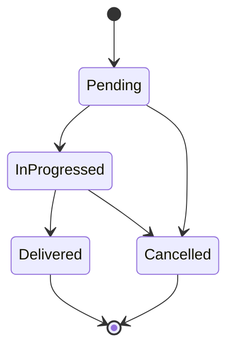

# Purchase status + `Transaction.PurchaseId` (order-style workflow)

Purchases should follow the **same lifecycle pattern as orders**: a **status** table seeded with stable ids, **`Purchase.StatusId`** FK, and **stock + ledger** only when the business says goods are finalized (mirroring **Delivered** on sales).

## `Transaction.PurchaseId` (implemented)

[`Transaction`](../../../backend/HamzaTex.Api/Entities/Transaction.cs) includes:

- **`PurchaseId`** (nullable FK → `purchases`) — set when a row is generated by the **purchase** flow (parallel to **`OrderId`** for sales).
- Index **`IX_transactions_purchase_id`** for lookups and idempotent posting checks.

**Service rules:**

- When posting purchase-related **`transactions`**, always set **`PurchaseId`** so reversals, audits, and “already posted” detection are reliable.
- Do not rely only on date/product matching.

## New: `purchase_statuses` (mirror `order_statuses`)

Add entity **`PurchaseStatus`** (same shape as [`OrderStatus`](../../../backend/HamzaTex.Api/Entities/OrderStatus.cs)) and **`Purchase.StatusId`** FK on [`Purchase`](../../../backend/HamzaTex.Api/Entities/Purchase.cs) (nullable → required for new creates per validation).

### Suggested seed (same ids and names as orders — parity)

| Id | Name | Procurement meaning (for staff) |
|----|------|----------------------------------|
| 1 | Pending | PO raised / expected; **no stock, no ledger** |
| 2 | InProgressed | In transit or partial processing |
| 3 | Delivered | **Goods received** — same *code* milestone as sales “Delivered”; **run stock In + post `transactions` here** |
| 4 | Cancelled | No receipt; reverse if you had posted earlier |

**UI label:** You may show **“Received”** for id **3** in the Purchases screen while keeping the stored name **`Delivered`** for consistency with `OrderStatus` and shared meta handling.

### Meta / API

- Extend [`ILookupService`](../../../backend/HamzaTex.Api/Services/LookupService.cs) + [`MetaController`](../../../backend/HamzaTex.Api/Controllers/MetaController.cs) pattern: e.g. **`purchasestatuses`** / **`purchase-statuses`** returning the same list as order statuses for the mobile app cache.
- Add to **`Meta/all`** payload in [`LookupDto`](../../../backend/HamzaTex.Api/Models/LookupDto.cs) if other lookups are aggregated there (mirror `OrderStatuses`).

## Workflow (aligned with orders)

- **Create purchase:** default **`StatusId = Pending`** (or **InProgressed** if you never use Pending for purchases—product decision). **No** `StockMovement`, **no** `Transaction` yet.
- **Transition to Delivered (3):** In one DB transaction: validate lines → **`StockMovementsService`** per line (`MovementSource = Purchase`) → insert **`Transaction`** rows with **`PurchaseId`** set → idempotent guard (e.g. existing transactions for this `PurchaseId`).
- **Transition to Cancelled (4):** If previously **Delivered**, reverse stock (Manual Out or policy) and post compensating **`transactions`** (same discipline as order cancellation). If never Delivered, no stock/ledger to reverse.

**Date fields:** Use **`PurchaseDate`** for document date; **`MovementDate`** / **`TransDate`** should align with the **Delivered** transition date when posting (same pattern as orders).

## Migrations

1. Create **`purchase_statuses`** table + seed (EF migration).
2. Add **`status_id`** (nullable first, backfill, then enforce) on **`purchases`** with FK to **`purchase_statuses`**.
3. **`Transaction.PurchaseId`** — if not already applied in your branch, include in migration chain; ensure FK to **`purchases`**.

## Related

- Ledger detail: [04-ledger-posting-rules.md](./04-ledger-posting-rules.md) (update mentally: posting on **Delivered**, not on create).
- Kickoff order: [07-implementation-kickoff.md](./07-implementation-kickoff.md).
- Seed + deploy: [08-seed-correction-and-greenfield-deployment.md](./08-seed-correction-and-greenfield-deployment.md).
